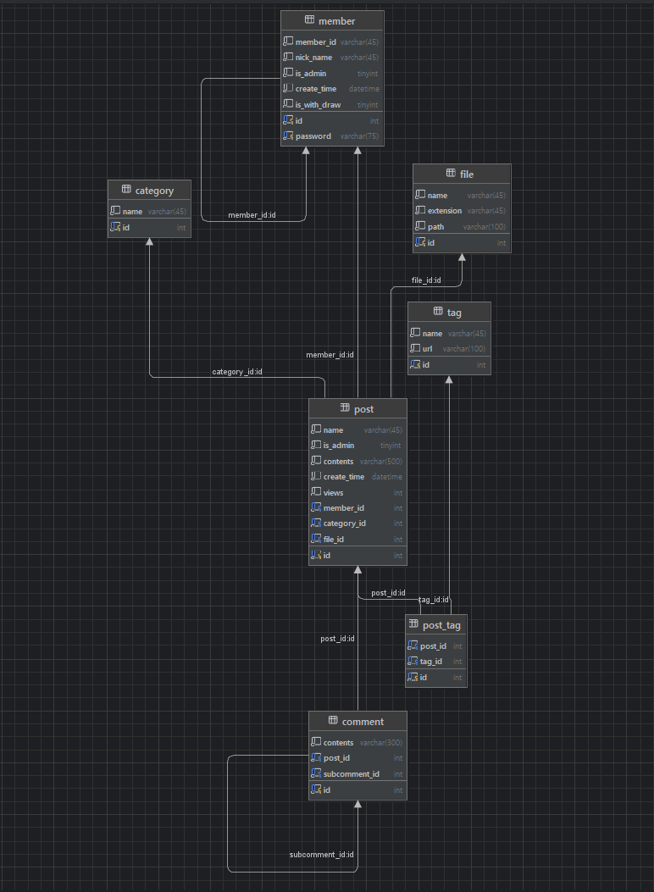
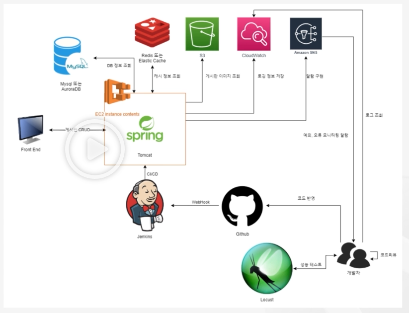

# 대용량 트래픽 게시판 프로젝트 
- Locust 를 이용해 대용량 트래픽 발생, 고려한 어플리케이션 개발 
- Locust 테스트:  https://github.com/hanboreum/Board-Server-Locust   
## 기간
- 2024.11.14 ~ 2024.11.27

## 인원
- 개인 프로젝트 (1인)

## 기술 스택 및 도구
- Java 17
- Spring Boot 3
- My SQL
- My Batis
- Locust
- Redis
- Jenkins
- AWS
- PuTTY

## ERD


## 배포 아키텍쳐


## API 명세서

- ### 회원

  - POST 회원 가입: /members/sign-up
  - POST 로그인: /members/sign-in
  - GET 내 정보 보기: /members/my-info
  - PUT: 로그아웃: /members/logout
  
- ### 게시글
  - POST 등록: /posts
  - GET 내 게시글 조회: /posts/my-posts
  - PATCH 수정: /posts/{postId}
  - DELETE  삭제: /posts/{postId}
- ### 검색

  - POST 게시글 검색: /search
  - GET 태그 검색: /search?tagName

- ### 댓글

  - POST 댓글 등록: /posts/comments
  - PATCH 댓글 수정: /posts/comments/{commentId}
  - DELETE 댓글 삭제 /posts/comments/{commentId}

- ### 태그

  - POST 태그 등록: /posts/tags
  - PATCH 태그 수정: /posts/tags/{tagId}
  - DELETE 태그 삭제: /posts/tags/{tagId}

- ### 카테고리

  - POST 카테고리 등록:/categories
  - PATCH 카테고리 수정: /categories/{categoryId}
  - DELETE 카테고리 삭제: /categories/{categoryId}

- ### sns

  - POST 토픽 생성: /create-topic?topicName={Param}
  - POST subscribe: /subscribe?enePoint={Param}&topicArn={Param}
  - POST publish: /publish?topicArn={Param}
  - GET Slack 알림: /slack/error

## 기능 구현

- MyBatis 를 사용한 게시판, 댓글, 해시태그 CRUD 기능
- SHA-256 해시 함수를 이용한 비밀번호 암호화
- 사용자 지정 어노테이션
- 검색 기능 성능 향상을 위한 RedisCacheManager
  - @Cacheable, @CacheEvict 어노테이션을 통한 성능 향상

## 패키지 구조
```bash
C:\PROJECT\BOARDSERVER
|   .gitattributes
|   .gitignore
|   build.gradle
|   gradlew
|   gradlew.bat
|   README.md
|   settings.gradle
|
+---.gradle
|   |   file-system.probe
|   |
|   +---8.10.2
|   |   |   gc.properties
|   |   |
|   |   +---checksums
|   |   |       checksums.lock
|   |   |       md5-checksums.bin
|   |   |       sha1-checksums.bin
|   |   |
|   |   +---dependencies-accessors
|   |   |       gc.properties
|   |   |
|   |   +---executionHistory
|   |   |       executionHistory.bin
|   |   |       executionHistory.lock
|   |   |
|   |   +---expanded
|   |   +---fileChanges
|   |   |       last-build.bin
|   |   |
|   |   +---fileHashes
|   |   |       fileHashes.bin
|   |   |       fileHashes.lock
|   |   |       resourceHashesCache.bin
|   |   |
|   |   \---vcsMetadata
|   +---buildOutputCleanup
|   |       buildOutputCleanup.lock
|   |       cache.properties
|   |       outputFiles.bin
|   |
|   \---vcs-1
|           gc.properties
|
+---.idea
|   |   .gitignore
|   |   compiler.xml
|   |   dataSources.local.xml
|   |   dataSources.xml
|   |   google-java-format.xml
|   |   gradle.xml
|   |   jarRepositories.xml
|   |   misc.xml
|   |   modules.xml
|   |   uiDesigner.xml
|   |   vcs.xml
|   |   workspace.xml
|   |
|   +---dataSources
|   |   |   0a3fa63f-6c0b-4446-9af4-a6664f578be4.xml
|   |   |
|   |   \---0a3fa63f-6c0b-4446-9af4-a6664f578be4
|   |       \---storage_v2
|   |           \---_src_
|   |               \---schema
|   |                       board_server.vM7fFg.meta
|   |
|   \---modules
|           boardserver.main.iml
|
+---build
|   +---classes
|   |   \---java
|   |       \---main
|   |           \---com
|   |               \---example
|   |                   \---boardserver
|   |                       |   BoardServerApplication.class
|   |                       |
|   |                       +---aop
|   |                       |       LoginCheck$UserType.class
|   |                       |       LoginCheck.class
|   |                       |       LoginCheckAspect$1.class
|   |                       |       LoginCheckAspect.class
|   |                       |
|   |                       +---config
|   |                       |       AWSConfig.class
|   |                       |       DatabaseConfig.class
|   |                       |       MySqlConfig.class
|   |                       |       RedisConfig.class
|   |                       |
|   |                       +---controller
|   |                       |       CategoryController.class
|   |                       |       MemberController.class
|   |                       |       PostController.class
|   |                       |       PostSearchController.class
|   |                       |       SnsController.class
|   |                       |
|   |                       +---dto
|   |                       |   |   CategoryDTO$SortStatus.class
|   |                       |   |   CategoryDTO.class
|   |                       |   |   CommentDTO$CommentDTOBuilder.class
|   |                       |   |   CommentDTO.class
|   |                       |   |   MemberDTO$Status.class
|   |                       |   |   MemberDTO.class
|   |                       |   |   PostDTO$PostDTOBuilder.class
|   |                       |   |   PostDTO.class
|   |                       |   |   TagDTO$TagDTOBuilder.class
|   |                       |   |   TagDTO.class
|   |                       |   |
|   |                       |   +---constant
|   |                       |   |       SlackConstant.class
|   |                       |   |
|   |                       |   +---request
|   |                       |   |       CategoryRequest.class
|   |                       |   |       MemberDeleteId.class
|   |                       |   |       MemberLoginRequest.class
|   |                       |   |       MemberUpdatePasswordRequest.class
|   |                       |   |       PostDeleteRequest.class
|   |                       |   |       PostRequest.class
|   |                       |   |       PostSearchRequest$PostSearchRequestBuilder.class
|   |                       |   |       PostSearchRequest.class
|   |                       |   |
|   |                       |   \---response
|   |                       |           CommonResponse.class
|   |                       |           LoginResponse$LoginStatus.class
|   |                       |           LoginResponse.class
|   |                       |           MemberInfoResponse.class
|   |                       |           PostResponse.class
|   |                       |           PostSearchResponse.class
|   |                       |
|   |                       +---exception
|   |                       |   |   BoardServerException.class
|   |                       |   |   DuplicateException.class
|   |                       |   |
|   |                       |   \---handler
|   |                       |           CustomExceptionHandler.class
|   |                       |
|   |                       +---mapper
|   |                       |       CategoryMapper.class
|   |                       |       CommentMapper.class
|   |                       |       MemberProfileMapper.class
|   |                       |       PostMapper.class
|   |                       |       PostSearchMapper.class
|   |                       |       TagMapper.class
|   |                       |
|   |                       +---service
|   |                       |   |   CategoryService.class
|   |                       |   |   MemberService.class
|   |                       |   |   PostSearchService.class
|   |                       |   |   PostService.class
|   |                       |   |   SlackService.class
|   |                       |   |   SnsService.class
|   |                       |   |
|   |                       |   \---impl
|   |                       |           CategoryServiceImpl.class
|   |                       |           MemberServiceImpl.class
|   |                       |           PostSearchServiceImpl.class
|   |                       |           PostServiceImpl.class
|   |                       |
|   |                       \---utils
|   |                               SessionUtil.class
|   |                               SHA256Util.class
|   |
|   +---generated
|   |   \---sources
|   |       +---annotationProcessor
|   |       |   \---java
|   |       |       \---main
|   |       \---headers
|   |           \---java
|   |               \---main
|   +---resources
|   |   \---main
|   |       |   application.properties
|   |       |   application.properties.file
|   |       |   log4j2.xml
|   |       |   mybatis-config.xml
|   |       |
|   |       +---mappers
|   |       |       categoryMapper.xml
|   |       |       commentMapper.xml
|   |       |       memberMapper.xml
|   |       |       postMapper.xml
|   |       |       postSearchMapper.xml
|   |       |       tagMapper.xml
|   |       |
|   |       +---static
|   |       \---templates
|   \---tmp
|       \---compileJava
|           |   previous-compilation-data.bin
|           |
|           \---compileTransaction
|               +---backup-dir
|               \---stash-dir
|                       PostSearchController.class.uniqueId1
|                       PostSearchServiceImpl.class.uniqueId0
|
+---gradle
|   \---wrapper
|           gradle-wrapper.jar
|           gradle-wrapper.properties
|
+---images
|       architecture.png
|       erd.png
|
+---logs
\---src
    +---main
    |   +---java
    |   |   \---com
    |   |       \---example
    |   |           \---boardserver
    |   |               |   BoardServerApplication.java
    |   |               |
    |   |               +---aop
    |   |               |       LoginCheck.java
    |   |               |       LoginCheckAspect.java
    |   |               |
    |   |               +---config
    |   |               |       AWSConfig.java
    |   |               |       DatabaseConfig.java
    |   |               |       MySqlConfig.java
    |   |               |       RedisConfig.java
    |   |               |
    |   |               +---controller
    |   |               |       CategoryController.java
    |   |               |       MemberController.java
    |   |               |       PostController.java
    |   |               |       PostSearchController.java
    |   |               |       SnsController.java
    |   |               |
    |   |               +---dto
    |   |               |   |   CategoryDTO.java
    |   |               |   |   CommentDTO.java
    |   |               |   |   MemberDTO.java
    |   |               |   |   PostDTO.java
    |   |               |   |   TagDTO.java
    |   |               |   |
    |   |               |   +---constant
    |   |               |   +---request
    |   |               |   |       CategoryRequest.java
    |   |               |   |       MemberDeleteId.java
    |   |               |   |       MemberLoginRequest.java
    |   |               |   |       MemberUpdatePasswordRequest.java
    |   |               |   |       PostDeleteRequest.java
    |   |               |   |       PostRequest.java
    |   |               |   |       PostSearchRequest.java
    |   |               |   |
    |   |               |   \---response
    |   |               |           CommonResponse.java
    |   |               |           LoginResponse.java
    |   |               |           MemberInfoResponse.java
    |   |               |           PostResponse.java
    |   |               |           PostSearchResponse.java
    |   |               |
    |   |               +---exception
    |   |               |   |   BoardServerException.java
    |   |               |   |   DuplicateException.java
    |   |               |   |
    |   |               |   \---handler
    |   |               |           CustomExceptionHandler.java
    |   |               |
    |   |               +---mapper
    |   |               |       CategoryMapper.java
    |   |               |       CommentMapper.java
    |   |               |       MemberProfileMapper.java
    |   |               |       PostMapper.java
    |   |               |       PostSearchMapper.java
    |   |               |       TagMapper.java
    |   |               |
    |   |               +---service
    |   |               |   |   CategoryService.java
    |   |               |   |   MemberService.java
    |   |               |   |   PostSearchService.java
    |   |               |   |   PostService.java
    |   |               |   |   SlackService.java
    |   |               |   |   SnsService.java
    |   |               |   |
    |   |               |   \---impl
    |   |               |           CategoryServiceImpl.java
    |   |               |           MemberServiceImpl.java
    |   |               |           PostSearchServiceImpl.java
    |   |               |           PostServiceImpl.java
    |   |               |
    |   |               \---utils
    |   |                       SessionUtil.java
    |   |                       SHA256Util.java
    |   |
    |   \---resources
    |       |   application.properties
    |       |   log4j2.xml
    |       |   mybatis-config.xml
    |       |
    |       +---mappers
    |       |       categoryMapper.xml
    |       |       commentMapper.xml
    |       |       memberMapper.xml
    |       |       postMapper.xml
    |       |       postSearchMapper.xml
    |       |       tagMapper.xml
    |       |
    |       +---static
    |       \---templates
    \---test
        \---java
            \---com
                \---example
                    \---boardserver
                            BoardServerApplicationTests.java

```


 더보기
- 프로젝트 기획: https://wonder-why.tistory.com/184
- Locust 성능 테스트: https://wonder-why.tistory.com/190
- Slack 알림: https://wonder-why.tistory.com/193
- 배포 자동화: https://wonder-why.tistory.com/194, https://wonder-why.tistory.com/195, https://wonder-why.tistory.com/196
